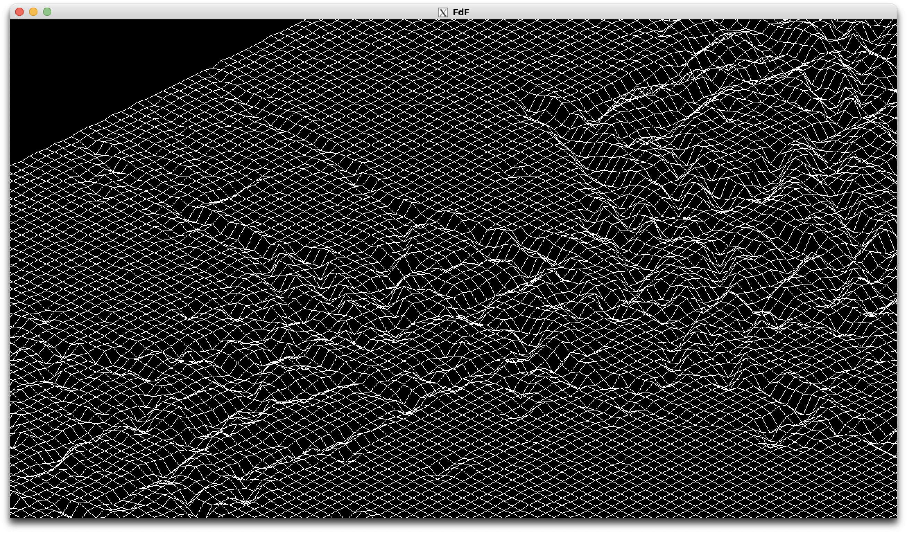

# FdF - Fil de Fer

## Summary

FdF is a 42 Project that aims to create an isometric 3D graphic representation of a terrain.

This project involves creating a graphical representation of a relief terrain in a schematic form. The program takes a file as input, containing coordinates representing points in space, and produces a wireframe rendering of the terrain. The rendering is displayed using an isometric projection based on the `Bresenham algorithm`.

# 




## Project Structure

The repository is organized with the following structure:

- Makefile: Automation script for compilation and project management.
- inc/: folder containing header files function prototypes and necessary definitions.
- src/*.c: Source files implementing various functions.

## Rules

- The project must be written in C.
- Adherence to the `42 School` Norm is mandatory.
- The program should not terminate unexpectedly, and memory must be handled properly to avoid leaks.
- Allowed External Functions: open, close, read, write, malloc, free, perror, strerror, exit

## Usage

This project only support Linux and was tested on Ubuntu 18.04.

```bash
make
./fdf [map].fdf
```

Maps are provided in the `assets/maps/` folder.

## Features

- `arrow keys` : Translation
- `mouse wheel` : Zoom
- `+` and `-` : Height
- `ESC` : Exit
- Colored terrain based color `hex` values in map files

## Rendering

- Render using an isometric projection based on `Bresenham algorithm`.
- Input coordinates provided in a file, with each number representing a point's position and altitude.
- Utilize [Minilibx](https://github.com/42Paris/minilibx-linux) library for rendering. The MinilibX is a simple X-Window (X11R6) programming API in C, designed for students, suitable for X-beginners.
- Display the rendering in a window.
- Ensure smooth window management (resizing, minimizing, etc.).

## Acquired Skills

- Understanding and implementing graphic rendering techniques.
- Working with external libraries like MiniLibX.
- Effectively managing memory and avoiding memory leaks.
- Developing a robust and well-structured C program.
- Handling user interactions in a graphical environment.

# Troubleshooting

If the git submodules didn't clone properly, you can run the following commands to clone the submodules:

```bash
git submodule update --init --force --remote
```

For macOS users, the project needs a X11 server to run. You can install it with [`Homebrew`](https://brew.sh/) using the following command:

```bash
brew install xquartz libx11 libext
reboot
```

If you have an issue with the window size, you can change the corresponding macros in the include file `fdf.h` located in the `inc/` folder: 

```c
# define WIDTH 1280
# define HEIGHT 720
```